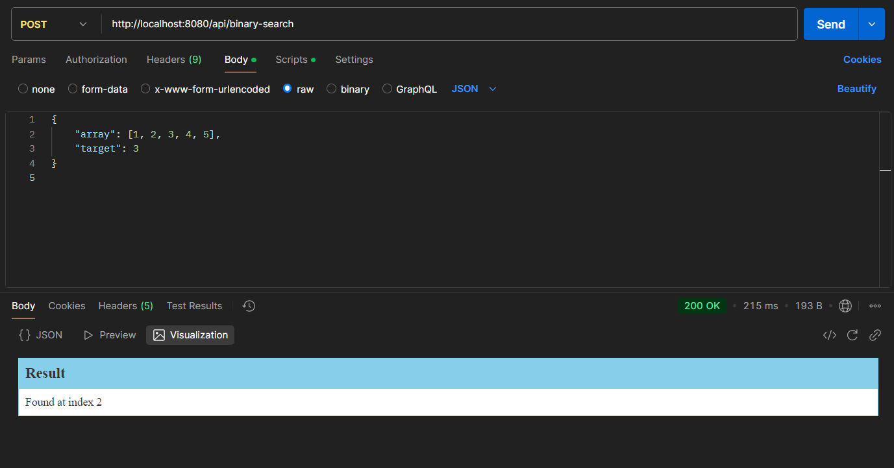
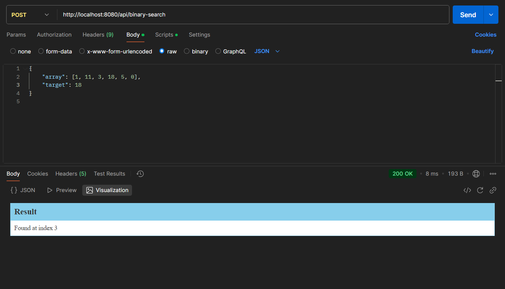
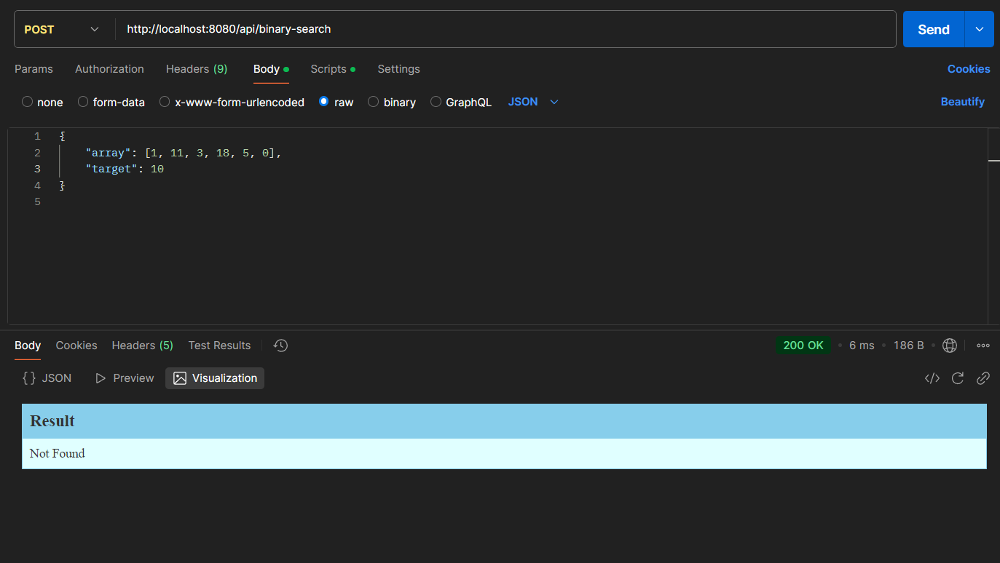

# BinarySearchSpringboot
This is a project that provides API(POST request using JSON) to use efficient binary search algo

*simple implementaion using postman app in a sorted array*


*simple implementaion using postman app in a unsorted array*



Like we are using of binary search algo , similarly we can use any LLM application using lanchain to make Ai powered apps and access using API's

## Features
- Implementation of binary search algorithm.
- REST API for searching elements in a sorted array.
- Lightweight and fast Spring Boot application.


## Installation
1. Clone the repository:
    ```bash
    git clone https://github.com/yourusername/BinarySearchSpringboot.git
    ```
2. Build the project:
    ```bash
    mvn clean install
    ```

## Usage
1. Run the application:
    ```bash
    mvn spring-boot:run
    ```
2. Access the API at `http://localhost:8080/api/binary-search`.

## API Endpoints
- **POST /search**  
  Request Body:
  ```json
    {
        "array": [1, 11, 3, 18, 5, 0],
        "target": 10
    }
  ```
  Response:
  ```json
  {
     "result": "Not Found"
  }
  ```
